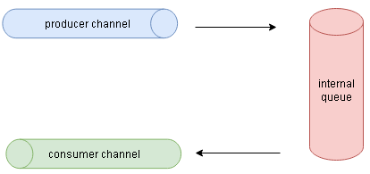
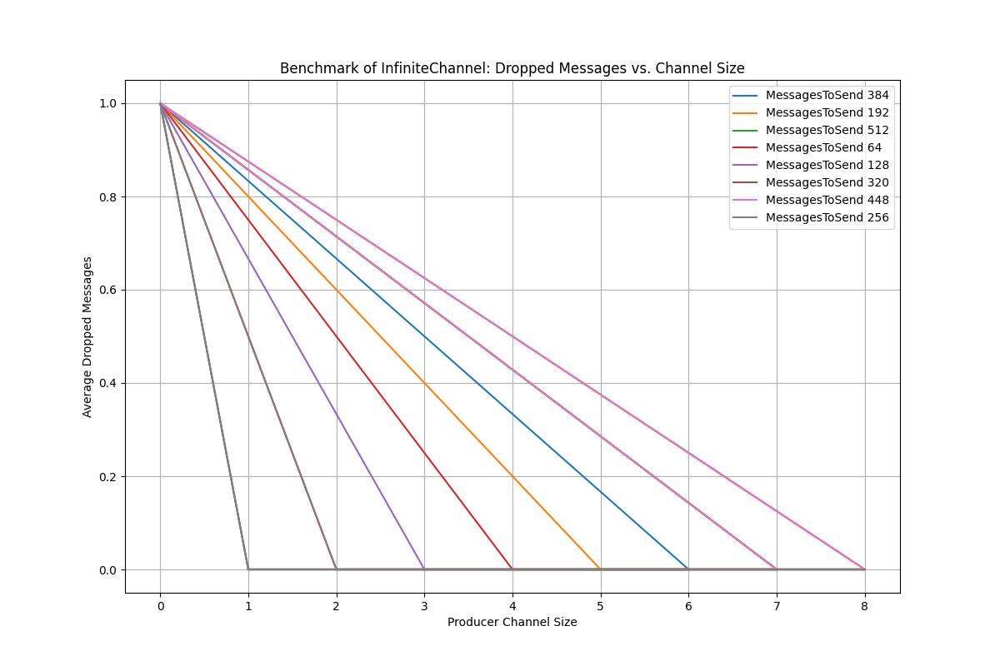

# InfiniteChannel

<!--  -->

`InfiniteChannel` is a concurrent data structure in Go that simulates an infinite channel, inspired by Kotlin's infinite channel. It provides a mechanism for asynchronous processing, allowing producers to add items to the channel without blocking, even if consumers are temporarily unavailable to process the items. This is achieved by using an internal queue to store items when the consumer channel is full, ensuring that no items are lost. This is useful for scenarios where producers might generate messages at a faster rate than consumers can process them.

<div style="text-align: center;">
  
</div>

### Why was InfiniteChannel Created?

The concept of an infinite channel is available in Kotlin, which I utilized in one of my earlier Kotlin-based Android application, a game. In this game, I needed to capture user clicks without blocking the UI since the user clicks are not known in advance. Kotlin's infinite channel provided an efficient solution for this scenario.

When transitioning to Go, I found that Go's standard library does not offer a similar construct. Thus, I created `InfiniteChannel` to simulate the infinite channel behavior in Go, enabling non-blocking asynchronous processing suitable for various use cases, including games and real-time applications.


### How to Use
To use `InfiniteChannel`, initialize it with the desired producer and consumer channel sizes, then add items to the channel and consume them using the provided methods. Below is an example:

```go
package main

import (
	"context"
	"fmt"
	"sync"
)

func main() {
	ic := NewInfiniteChannel[int](2, 2)
	defer ic.ForceStop()

	var wg sync.WaitGroup
	wg.Add(2)

	// Producer
	go func() {
		defer wg.Done()
		for i := 0; i < 10; i++ {
			if !ic.Add(i) {
				fmt.Println("Failed to add item:", i)
			}
		}
	}()

	// Consumer
	go func() {
		defer wg.Done()
		for {
			ctx, cancel := context.WithTimeout(context.Background(), 100*time.Millisecond)
			defer cancel()

			item, isClosed := ic.TakeWithContext(ctx)
			if isClosed {
				break
			}
			fmt.Println("Consumed item:", item)
		}
	}()

	wg.Wait()
}
```

### Benchmark Results
Benchmarking was conducted to measure the number of dropped messages for various producer channel sizes, with messages sent at fixed intervals (specifically, producers produced messages at a rate of 1 message every 10 microseconds). The results demonstrate that the InfiniteChannel effectively manages message drops, maintaining a low drop rate even with high message throughput. 

<div style="text-align: center;">
  
</div>

Benchmarking code that was used to generate the results can be found in the file  `infinite_channel_benchmark_test.go`. 
To generate the results run `go test -bench=.`, this creates a CSV file containing the benchmark data. To generate the graph run `python generate_graph.py`, which reads the CSV file to create the graph.


### Conclusion

`InfiniteChannel` reduces the number of dropped messages compared to plain buffered channels, even with a small buffer size. This improvement comes with a trade-off in increased CPU and memory utilization.


